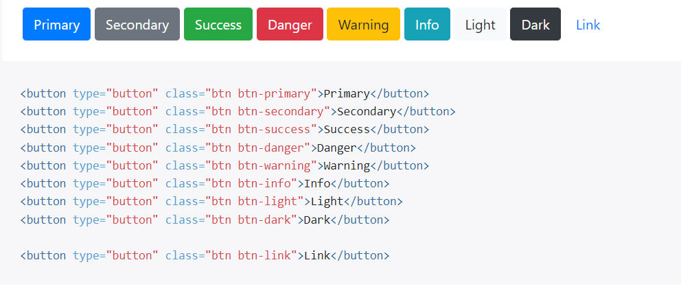

# Boostrap FreeCodeCamp

## Responsivo

 - **container-fluid:** ajusta elementos filhos de acordo com o tamanho da tela
 - **img-responsive:** ajusta imagem 

 ## Text
 
 - **text-center =** text-align:center

 ## Style default

 - **btn btn-default**: A largura é determinada pelo tamanho do texto do button
 - **btn-block**: O botão ocupa o espaço de 100% da largura disponível

## Grid

 *'N' = quantas colunas de largura o elemento deve ter*

 - **row**: elemento pai
 - **col-xs-N** xs = extra-small(telas menores)
- **col-md-N** xs = medium 